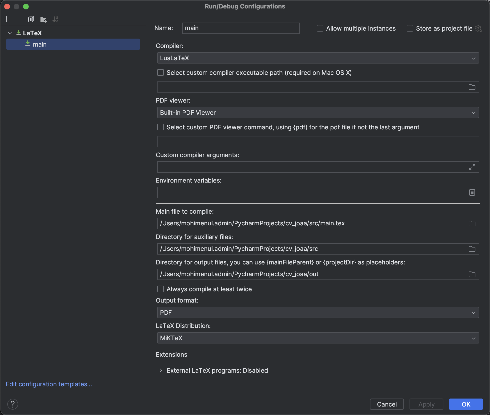
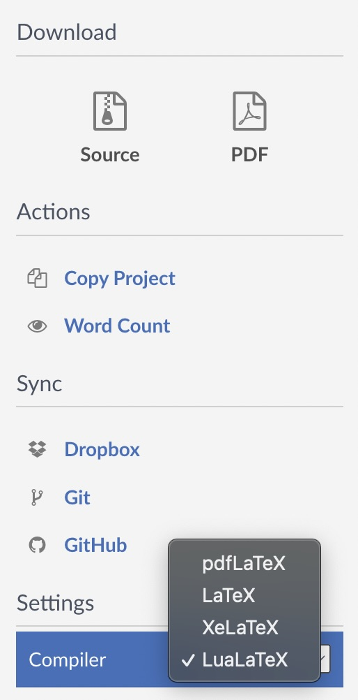
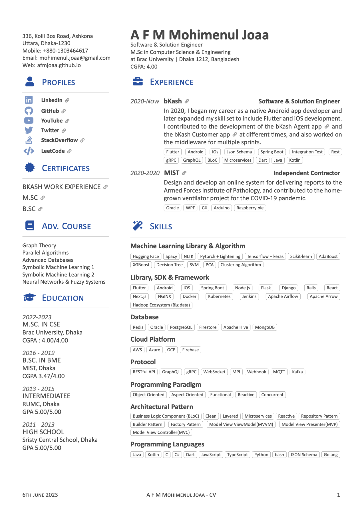
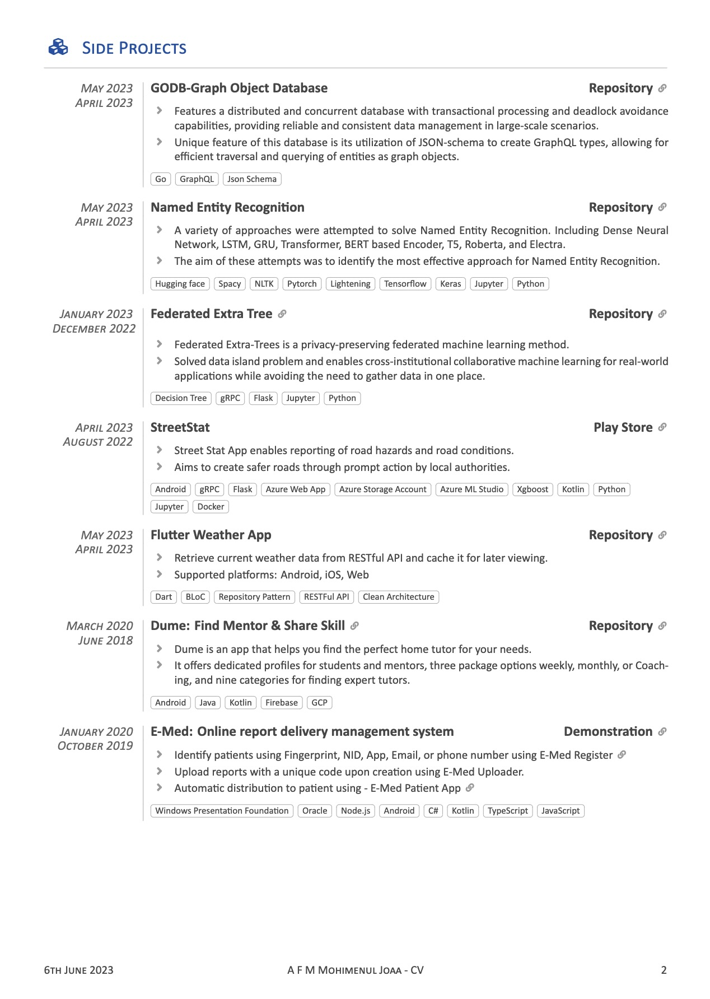

## CV Template

This is a customizable CV template designed for use with LaTeX editor. 
The template allows you to create a professional-looking CV with ease, 
using predefined commands for different sections and a centralized design file.

## Instructions

You can use the template to compile the cv in two approach

### 1. Local (Using PyCharm) 

- Install a LaTeX distribution. [MiKTeX](https://miktex.org/download) is preferred.
- Install [PyCharm](https://www.jetbrains.com/pycharm/download)
- Install [TeXiFy IDEA](https://plugins.jetbrains.com/plugin/9473-texify-idea) plugin for PyCharm
- Install [PDF Viewer](https://plugins.jetbrains.com/plugin/14494-pdf-viewer) plugin for PyCharm
- Add a new configuration for LaTeX.
- Add LauLaTex as the compiler in the configuration.
- Add Built-in PDF Viewer as default pdf viewer.
- Add MiKTeX as the LaTex Distribution.
- Select the main tex file for compilation. Add ``src`` directory as auxiliary file directory.
- Create ``out`` directory in the project and add it as directory for output files.
- Tap ``run`` and enjoy!!!

### 2. Online (Using Overleaf)

- From the GitHub repo download the project as zip.
- In the [Overleaf](https://www.overleaf.com/project) project section, section ``New Project -> Upload Project``.
- Select the downloaded zip file.
- From the Menu section change the compiler to LuaLaTex.
- Tap ``Recompile`` and enjoy.

### To edit the template, follow the steps below:

1. After choosing any of the above approach for compilation you can edit the files in you choose of editor.
2. ``main.tex`` file is the entry point.
3. ``main.cls`` file is the entry point for styles.
4. If you don't like blue, you can easily change the theme by changing the accent color in line 51 of ``main.cls``
5. ``\definecolor{accentColor}{HTML}{1751A7}`` change ``1751A7`` with your choose of color and recompile to see the effect.
6. Customize the CV content by modifying the respective tex files for each section.
7. Feel free to customize the template further by adding or removing sections, modifying the design, or adjusting the predefined commands to suit your specific needs.
8. Happy coding 😊!!!

## File Structure

The template repository has the following file structure:

- `main.tex`: The entry point of the CV. This file should be compiled to generate the final PDF.
- `main.cls`: The class file that defines the overall design and formatting of the CV.
- `sections/`: This directory contains separate tex files for different sections of the CV (e.g., education, experience, skills).
- `assets/`: If you have any images to include in the CV, place them in this directory.
- `footer.tex`: Contains the footer.
- `fonts/`: Contain the calibri fonts, that is used in the template.

## Showcase

For a visual representation of the CV template, you can refer to the [dummy-cv.pdf](./src/cv/dummy-cv.pdf) file included in this repository. 

## License

This CV template is provided under the [GNU Affero General Public License](LICENSE), allowing you to use, 
modify, and distribute it freely. The GNU Affero General Public License is a copyleft license that 
requires any modifications or additions to the template to be released under the same license when 
distributed. You can include attribution to the original author by mentioning the link to the template 
repository in your CV.

## Show Your Support

If you find this repository useful, I kindly ask you to:

- Star this repository by clicking the ⭐️ button. It helps to showcase the project to others who may find it helpful as well.
- Include an attribution in your project's documentation, acknowledging the use of this repository.

Your support and recognition are greatly appreciated. Thank you for using this repository and helping to spread the word!

## Contribution
If you encounter any issues or have suggestions for improvements, please feel free to open an issue.
If you find the solution then you also folk the GitHub repository and create a pull request.

If you find this template useful and decide to use it, add a star 

Happy CV building 😊!!!
